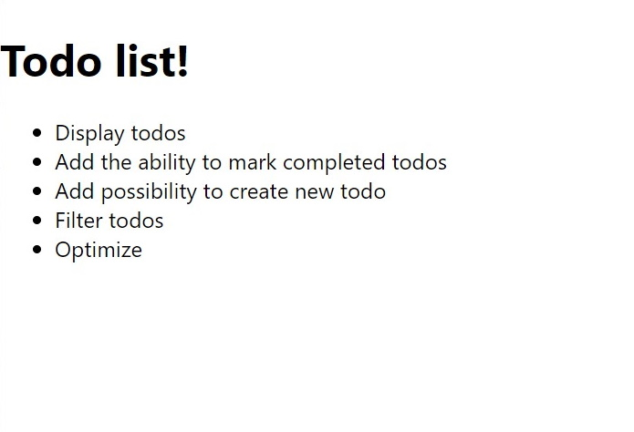

# Create state

> In this part you'll learn how to create stocked state in your components

## Initial state

Let's provide initial state for the stock root component

import Tabs from '@theme/Tabs';
import TabItem from '@theme/TabItem';

<Tabs
    defaultValue="js"
    groupId="language"
    values={[
        { label: 'JavaScript', value: 'js' },
        { label: 'TypeScript', value: 'ts' }
    ]}
>
<TabItem value="js">

```jsx title=./src/App.jsx
import { StockRoot } from 'stocked';

function App() {
    return (
        <StockRoot
            initialValues={{
                // highlight-start
                todos: [
                    {
                        title: 'Display todos',
                        completed: false,
                    },
                    {
                        title: 'Add the ability to mark completed todos',
                        completed: false,
                    },
                    {
                        title: 'Add possibility to create new todo',
                        completed: false,
                    },
                    {
                        title: 'Filter todos',
                        completed: false,
                    },
                    {
                        title: 'Optimize',
                        completed: false,
                    },
                ],
                // highlight-end
            }}
        >
            <h1>Todo list!</h1>
        </StockRoot>
    );
}

export default App;
```

</TabItem>
<TabItem value="ts">

```tsx title=./src/App.tsx
import { StockRoot } from 'stocked';

// highlight-start
export type TodoItemData = {
    title: string;
    completed: boolean;
};

type AppState = {
    todos: TodoItemData[];
};
// highlight-end

function App() {
    return (
        <StockRoot<AppState>
            initialValues={{
                // highlight-start
                todos: [
                    {
                        title: 'Display todos',
                        completed: false,
                    },
                    {
                        title: 'Add the ability to mark completed todos',
                        completed: false,
                    },
                    {
                        title: 'Add possibility to create new todo',
                        completed: false,
                    },
                    {
                        title: 'Filter todos',
                        completed: false,
                    },
                ],
                // highlight-end
            }}
        >
            <h1>Todo list!</h1>
        </StockRoot>
    );
}

export default App;
```

</TabItem>
</Tabs>

## Display todos

Now, we'll create a component - `TodoList.jsx`. This component will render list of todo items.

<Tabs
    defaultValue="js"
    groupId="language"
    values={[
        { label: 'JavaScript', value: 'js' },
        { label: 'TypeScript', value: 'ts' }
    ]}
>
<TabItem value="js">

```jsx title=./src/TodoList.jsx
import { useStockValue } from 'stocked';
export const TodoList = () => {
    const todos = useStockValue('todos');

    return (
        <ul>
            {todos.map(({ title }, key) => (
                <li key={key}>{title}</li>
            ))}
        </ul>
    );
};
```

</TabItem>
<TabItem value="ts">

```tsx title=./src/TodoList.tsx
import { useStockValue } from 'stocked';
import { TodoItemData } from './App';

export const TodoList = () => {
    const todos = useStockValue<TodoItemData[]>('todos');

    return (
        <ul>
            {todos.map(({ title }, key) => (
                <li key={key}>{title}</li>
            ))}
        </ul>
    );
};
```

</TabItem>
</Tabs>

As you can see, we're using array of todos from the stock. Every time when todos will be updated in the stock, our `TodoList` component will re-render. Let's use this component in our app:

<Tabs
    defaultValue="js"
    groupId="language"
    values={[
        { label: 'JavaScript', value: 'js' },
        { label: 'TypeScript', value: 'ts' }
    ]}
>
<TabItem value="js">

```jsx title=./src/App.jsx
import { TodoList } from './TodoList';

// ...

function App() {
    return (
        <StockRoot
            initialValues={{ /* ... */ }}
        >
            <h1>Todo list!</h1>
            {/* highlight-next-line */}
            <TodoList />
        </StockRoot>
    );
}

export default App;
```

</TabItem>
<TabItem value="ts">

```tsx title=./src/App.tsx
import { TodoList } from './TodoList';

// ...

function App() {
    return (
        <StockRoot<AppState>
            initialValues={{ /* ... */ }}
        >
            <h1>Todo list!</h1>
            {/* highlight-next-line */}
            <TodoList />
        </StockRoot>
    );
}

export default App;
```

</TabItem>
</Tabs>

## Intermediate result

And this is what we have at the moment:

<p align="center">



</p>

Let's move on.