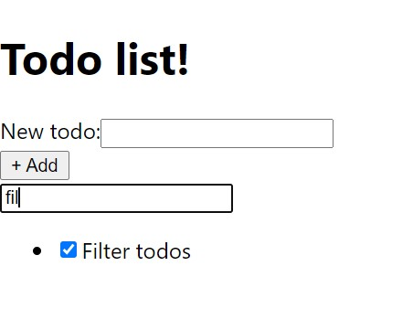

# Filters

> In this part you'll learn how to correctly manage your state without sacrificing performance

## Creating component

Let's create component, which will contain filters:

import Tabs from '@theme/Tabs';
import TabItem from '@theme/TabItem';

<Tabs
    defaultValue="js"
    groupId="language"
    values={[
        { label: 'JavaScript', value: 'js' },
        { label: 'TypeScript', value: 'ts' }
    ]}
>
<TabItem value="js">

```jsx title=Filters.jsx
import { useCallback } from 'react';
import { useStockState } from 'stocked';

export const Filters = () => {
    const [titleFilter, setTitleFilter] = useStockState('filters.title');

    const onChange = useCallback((e) => {
        setTitleFilter(e.target.value);
    }, [setTitleFilter]);

    return (
        <div>
            <input placeholder="Search..." value={titleFilter} onChange={onChange} />
        </div>
    );
}
```

</TabItem>
<TabItem value="ts">

```tsx title=Filters.tsx
import { ChangeEvent, useCallback } from 'react';
import { useStockState } from 'stocked';

export const Filters = () => {
    const [titleFilter, setTitleFilter] = useStockState<string>('filters.title');

    const onChange = useCallback((e: ChangeEvent<HTMLInputElement>) => {
        setTitleFilter(e.target.value);
    }, [setTitleFilter]);

    return (
        <div>
            <input placeholder="Search..." value={titleFilter} onChange={onChange} />
        </div>
    );
}
```

</TabItem>
</Tabs>

And, let's use new component in our `App`:

<Tabs
    defaultValue="js"
    groupId="language"
    values={[
        { label: 'JavaScript', value: 'js' },
        { label: 'TypeScript', value: 'ts' }
    ]}
>
<TabItem value="js">

```jsx title=App.jsx
// highlight-next-line
import { Filters } from "./Filters";

// ...

function App() {
    return (
        <StockRoot
            initialValues={{
                /** ... */
                // highlight-start
                filters: {
                    title: ''
                }
                // highlight-end
            }}
        >
            <h1>Todo list!</h1>
            <NewTodo />
            {/* highlight-next-line */}
            <Filters />
            <TodoList />
        </StockRoot>
    );
}

export default App;
```

</TabItem>
<TabItem value="ts">

```tsx title=App.tsx
// highlight-next-line
import { Filters } from "./Filters";

// ...

type AppState = {
    todos: TodoItemData[];
    newTodo: {
        title: string
    };
    // highlight-start
    filters: {
        title: string;
    };
    // highlight-end
};

function App() {
    return (
        <StockRoot<AppState>
            initialValues={{
                /** ... */
                // highlight-start
                filters: {
                    title: ''
                }
                // highlight-end
            }}
        >
            <h1>Todo list!</h1>
            <NewTodo />
            {/* highlight-next-line */}
            <Filters />
            <TodoList />
        </StockRoot>
    );
}

export default App;
```

</TabItem>
</Tabs>

How it looks like:

<p align="center">


</p>

However, currenlty our todo list is not filtered. That's because `TodoList` component does not respond to the filter's changes. 

Let's fix it!

## Modifing TodoList component

Currently, our `TodoList` depends only on length of todos. However, now, we need to make this component re-render each time, when filters are changing. To do this, `stocked` has function `watch`, which lets you to observe some value from stock.

<Tabs
    defaultValue="js"
    groupId="language"
    values={[
        { label: 'JavaScript', value: 'js' },
        { label: 'TypeScript', value: 'ts' }
    ]}
>
<TabItem value="js">

```jsx title=TodoList.jsx
import { useCallback, useEffect, useState } from "react";
import { useStockContext } from "stocked";
import { TodoItem } from "./TodoItem";

export const TodoList = () => {
    const { watch, getValue } = useStockContext();

    const [visibleKeys, setVisibleKeys] = useState(() =>
        getValue("todos").map((_, index) => index)
    );

    const filterItems = useCallback(
        (filterTitle) => {
        const allTodos = getValue("todos");

        const newKeys = allTodos
            .map((value, index) => ({ ...value, index }))
            .filter(({ title }) =>
                title.toLowerCase().includes(filterTitle.toLowerCase())
            )
            .map(({ index }) => index);

        setVisibleKeys(newKeys);
        },
        [getValue]
    );

    useEffect(
        // observing length of array
        () => watch("todos.length", () => filterItems(getValue("filters.title"))),
        [watch, filterItems, getValue]
    );

    // observing filter
    useEffect(() => watch("filters.title", filterItems), [watch, filterItems]);

    return (
        <ul>
        {visibleKeys.map((key) => (
            <TodoItem key={key} index={key} />
        ))}
        </ul>
    );
};
```

</TabItem>
<TabItem value="ts">

```tsx title=TodoList.tsx
import { useCallback, useEffect, useState } from "react";
import { useStockContext } from "stocked";
import { TodoItemData } from "./App";
import { TodoItem } from "./TodoItem";

export const TodoList = () => {
    const { watch, getValue } = useStockContext();

    const [visibleKeys, setVisibleKeys] = useState<number[]>(() =>
        getValue<TodoItemData[]>("todos").map((_, index) => index)
    );

    const filterItems = useCallback(
        (filterTitle: string) => {
        const allTodos = getValue<TodoItemData[]>("todos");

        const newKeys = allTodos
            .map((value, index) => ({ ...value, index }))
            .filter(({ title }) =>
                title.toLowerCase().includes(filterTitle.toLowerCase())
            )
            .map(({ index }) => index);

        setVisibleKeys(newKeys);
        },
        [getValue]
    );

    useEffect(
        // observing length of array
        () => watch("todos.length", () => filterItems(getValue("filters.title"))),
        [watch, filterItems, getValue]
    );

    // observing filter
    useEffect(() => watch("filters.title", filterItems), [watch, filterItems]);

    return (
        <ul>
        {visibleKeys.map((key) => (
            <TodoItem key={key} index={key} />
        ))}
        </ul>
    );
};
```

</TabItem>
</Tabs>

## Final result

And that's it the final result

<p align="center">



</p>
