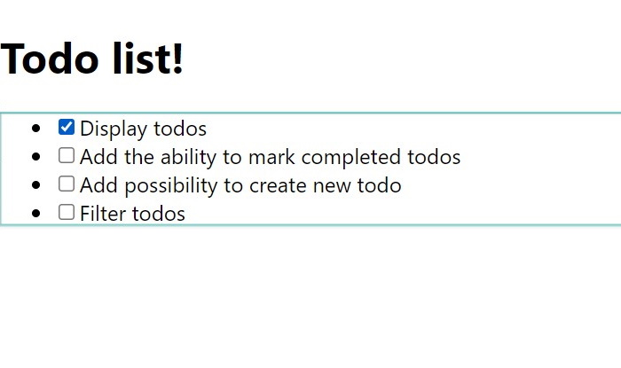
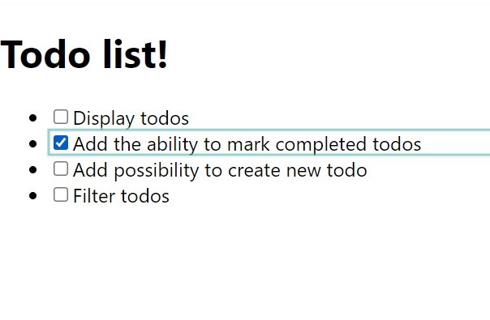
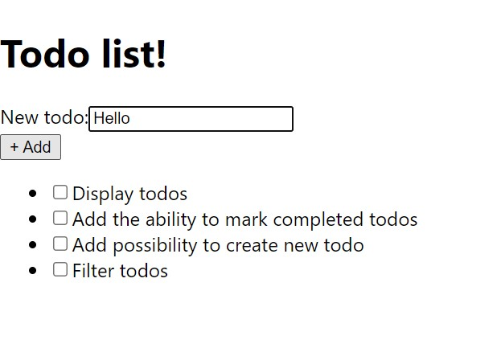

# Update state

> In this part you'll learn how to properly update state stored in stock

## Checkboxes

Let's add checkboxes to our todos.

import Tabs from '@theme/Tabs';
import TabItem from '@theme/TabItem';

<Tabs
    defaultValue="js"
    groupId="language"
    values={[
        { label: 'JavaScript', value: 'js' },
        { label: 'TypeScript', value: 'ts' }
    ]}
>
<TabItem value="js">

```jsx title=TodoList.jsx
import { useStockValue, useStockContext } from 'stocked';

export const TodoList = () => {
    // highlight-start
    const { setValue } = useStockContext();
    // highlight-end
    const todos = useStockValue('todos');

    return (
        <ul>
            {todos.map(({ title }, key) => (
                <li key={key}>
                    {/* highlight-start */}
                    <input
                        id={`todo-${key}`}
                        type="checkbox"
                        checked={completed}
                        onChange={(e) =>
                            setValue(`todos[${key}].completed`, e.target.checked)
                        }
                    />
                    <label htmlFor={`todo-${key}`}>{title}</label>
                    {/* highlight-end */}
                </li>
            ))}
        </ul>
    );
};
```

</TabItem>
<TabItem value="ts">

```tsx title=TodoList.tsx
import { useStockValue, useStockContext } from 'stocked';
import { TodoItemData } from './App';

export const TodoList = () => {
    // highlight-start
    const { setValue } = useStockContext();
    // highlight-end
    const todos = useStockValue<TodoItemData[]>('todos');

    return (
        <ul>
            {todos.map(({ title }, key) => (
                <li key={key}>
                    {/* highlight-start */}
                    <input
                        id={`todo-${key}`}
                        type="checkbox"
                        checked={completed}
                        onChange={(e) =>
                            setValue(`todos[${key}].completed`, e.target.checked)
                        }
                    />
                    <label htmlFor={`todo-${key}`}>{title}</label>
                    {/* highlight-end */}
                </li>
            ))}
        </ul>
    );
};
```

</TabItem>
</Tabs>

As you can see, we're changing todo item's state via `setValue` function. This function deeply sets value in object. 

This means, that when our value in stock is:

```js
{
    todos: [
        {
            title: 'Some title'
            completed: false,
        }
    ]
}
```

We can access `completed` variable by path `todos[0].completed`.

But, now, when user clicks on checkbox whole app re-renders. We can view it thanks to React developer tools:

<p align="center">



</p>

:::note

Cyan outline indicates which component re-renders

:::

Let's fix this issue!

## Optimization

Firstly, let's isolate todo item state. To do this, we'll create a new component `TodoItem`.

<Tabs
    defaultValue="js"
    groupId="language"
    values={[
        { label: 'JavaScript', value: 'js' },
        { label: 'TypeScript', value: 'ts' }
    ]}
>
<TabItem value="js">

```jsx title=TodoItem.jsx
import { useCallback } from 'react';
import { useStockValue, useStockState } from 'stocked';

export const TodoItem = ({ index }) => {
    const title = useStockValue(`todos[${index}].title`);
    const [completed, setCompleted] = useStockState(`todos[${index}].completed`);

    const onChange = useCallback((e) => {
        setCompleted(e.target.checked);
    }, [setCompleted]);

    return (
        <li>
            <input
                id={`todo-${index}`}
                type="checkbox"
                checked={completed}
                onChange={onChange}
            />
            <label htmlFor={`todo-${index}`}>{title}</label>
        </li>
    );
}
```

</TabItem>
<TabItem value="ts">

```tsx title=TodoItem.tsx
import { ChangeEvent, useCallback } from 'react';
import { useStockValue, useStockState } from 'stocked';

type TodoItemProps = {
    index: number;
}

export const TodoItem = ({ index }: TodoItemProps) => {
    const title = useStockValue<string>(`todos[${index}].title`);
    const [completed, setCompleted] = useStockState<boolean>(`todos[${index}].completed`);

    const onChange = useCallback((e: ChangeEvent<HTMLInputElement>) => {
        setCompleted(e.target.checked);
    }, [setCompleted]);

    return (
        <li>
            <input
                id={`todo-${index}`}
                type="checkbox"
                checked={completed}
                onChange={onChange}
            />
            <label htmlFor={`todo-${index}`}>{title}</label>
        </li>
    );
}
```

</TabItem>
</Tabs>

Then, we need to change our `TodoList` component:

<Tabs
    defaultValue="js"
    groupId="language"
    values={[
        { label: 'JavaScript', value: 'js' },
        { label: 'TypeScript', value: 'ts' }
    ]}
>
<TabItem value="js">

```jsx title=TodoItem.jsx
import { useStockValue } from "stocked";
import { TodoItem } from "./TodoItem";

export const TodoList = () => {
    const todos = useStockValue("todos");

    return (
        <ul>
            {todos.map((_, key) => (
                {/* highlight-next-line */}
                <TodoItem key={key} index={key} />
            ))}
        </ul>
    );
};
```

</TabItem>
<TabItem value="ts">

```tsx title=TodoItem.tsx
import { useStockValue } from "stocked";
import { TodoItemData } from "./App";
import { TodoItem } from "./TodoItem";

export const TodoList = () => {
    const todos = useStockValue<TodoItemData[]>("todos");

    return (
        <ul>
            {todos.map((_, key) => (
                {/* highlight-next-line */}
                <TodoItem key={key} index={key} />
            ))}
        </ul>
    );
};
```

</TabItem>
</Tabs>

As you can see, we don't need todos array to render them - we need only count. So, let's get only array length inside `TodoList` component:

<Tabs
    defaultValue="js"
    groupId="language"
    values={[
        { label: 'JavaScript', value: 'js' },
        { label: 'TypeScript', value: 'ts' }
    ]}
>
<TabItem value="js">

```jsx title=TodoList.jsx
import { useStockValue } from "stocked";
import { TodoItem } from "./TodoItem";

export const TodoList = () => {
    const todoCount = useStockValue("todos.length");

    return (
        <ul>
            {/* highlight-next-line */}
            {new Array(todoCount).fill(0).map((_, key) => (
                <TodoItem key={key} index={key} />
            ))}
        </ul>
    );
};
```

</TabItem>
<TabItem value="ts">

```tsx title=TodoList.tsx
import { useStockValue } from "stocked";
import { TodoItem } from "./TodoItem";

export const TodoList = () => {
    const todoCount = useStockValue<number>("todos.length");

    return (
        <ul>
            {/* highlight-next-line */}
            {new Array(todoCount).fill(0).map((_, key) => (
                <TodoItem key={key} index={key} />
            ))}
        </ul>
    );
};
```

</TabItem>
</Tabs>

So, let's check our performance now:

<p align="center">



</p>

Perfect! Now, only one todo is highlighted!

## New todo

Finally, let's create possibility to add new todo. For this feature, we will create `NewTodo` component:

<Tabs
    defaultValue="js"
    groupId="language"
    values={[
        { label: 'JavaScript', value: 'js' },
        { label: 'TypeScript', value: 'ts' }
    ]}
>
<TabItem value="js">

```jsx title=NewTodo.jsx
import { useCallback } from 'react';
import { useStockState, useStockContext } from 'stocked';

export const NewTodo = () => {
    const { getValue, setValue } = useStockContext();
    
    const [title, setTitle] = useStockState('newTodo.title');

    const onChange = useCallback((e) => {
        setTitle(e.target.value);    
    }, [setTitle]);

    const createNewTodo = useCallback(() => {
        const currentTitle = getValue('newTodo.title');
        const currentTodos = getValue('todos');

        setValue('todos', [...currentTodos, {
            title: currentTitle,
            completed: false,
        }]);
        
        setValue('newTodo.title', '');
    }, [getValue, setValue]);

    return (
        <div>
            <div>
                <label htmlFor="new-title">New todo:</label>
                <input id="new-title" value={title} onChange={onChange} />
            </div>
            <button onClick={createNewTodo}>+ Add</button>
        </div>
    );
};
```

</TabItem>
<TabItem value="ts">

```tsx title=NewTodo.tsx
import { ChangeEvent, useCallback } from 'react';
import { useStockState, useStockContext } from 'stocked';
import { TodoItemData } from './App'

export const NewTodo = () => {
    const { getValue, setValue } = useStockContext();
    
    const [title, setTitle] = useStockState<string>('newTodo.title');

    const onChange = useCallback((e: ChangeEvent<HTMLInputElement>) => {
        setTitle(e.target.value);    
    }, [setTitle]);

    const createNewTodo = useCallback(() => {
        const currentTitle = getValue('newTodo.title');
        const currentTodos = getValue<TodoItemData[]>('todos');

        setValue('todos', [...currentTodos, {
            title: currentTitle,
            completed: false,
        }]);

        setValue('newTodo.title', '');
    }, [getValue, setValue]);

    return (
        <div>
            <div>
                <label htmlFor="new-title">New todo:</label>
                <input id="new-title" value={title} onChange={onChange} />
            </div>
            <button onClick={createNewTodo}>+ Add</button>
        </div>
    );
};
```

</TabItem>
</Tabs>

And use this component in `App`:

<Tabs
    defaultValue="js"
    groupId="language"
    values={[
        { label: 'JavaScript', value: 'js' },
        { label: 'TypeScript', value: 'ts' }
    ]}
>
<TabItem value="js">

```jsx title=App.jsx
// highlight-next-line
import { NewTodo } from "./NewTodo";

// ...

function App() {
    return (
        <StockRoot
            initialValues={{
                /** */
                // highlight-start
                newTodo: {
                    title: ''
                }
                // highlight-end
            }}
        >
            <h1>Todo list!</h1>
            {/* highlight-next-line */}
            <NewTodo />
            <TodoList />
        </StockRoot>
    );
}

export default App;
```

</TabItem>
<TabItem value="ts">

```tsx title=App.tsx
// highlight-next-line
import { NewTodo } from "./NewTodo";

// ...

type AppState = {
    todos: TodoItemData[];
    // highlight-start
    newTodo: {
        title: string
    }
    // highlight-end
};

function App() {
    return (
        <StockRoot<AppState>
            initialValues={{
                /** ... */
                // highlight-start
                newTodo: {
                    title: ''
                }
                // highlight-end
            }}
        >
            <h1>Todo list!</h1>
            {/* highlight-next-line */}
            <NewTodo />
            <TodoList />
        </StockRoot>
    );
}

export default App;
```

</TabItem>
</Tabs>

## Intermediate result

And this is what we have at the moment:

<p align="center">



</p>

Let's move on.